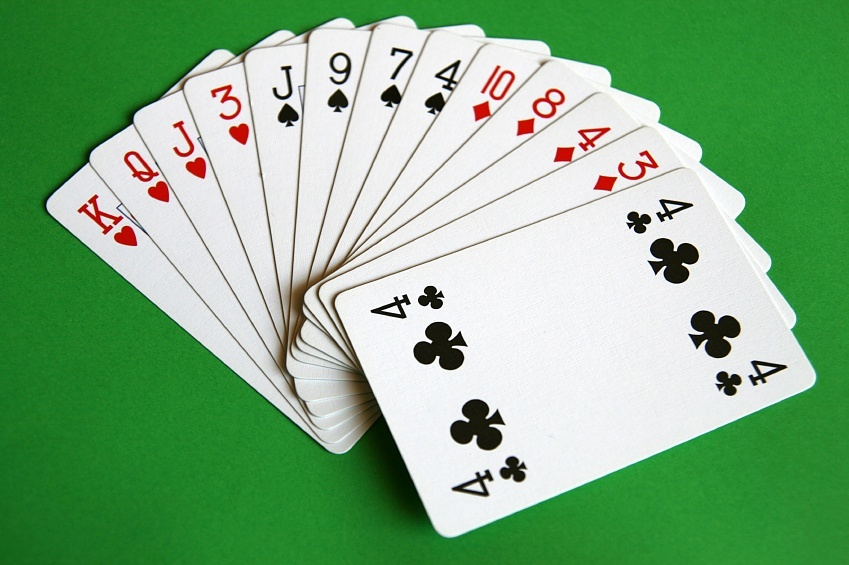
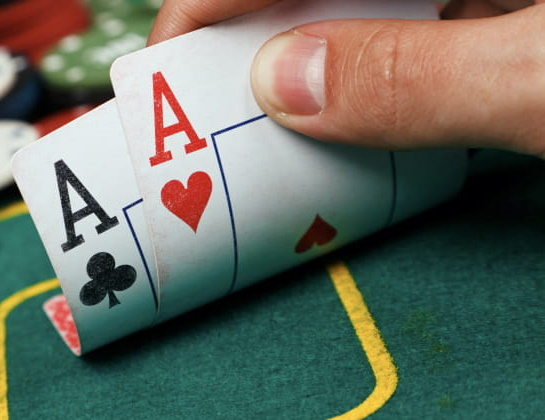

# Exercise - Creating the game of War

## Game rules
This card game can be played with two to four people. The rules are as follows:

For this game you will need a complete deck of 52 cards. Shuffle these cards, then divide them in such a way that every player has an equal amount. 

Players will, at the same time, reveal the top card of their deck, putting it in front of them. The player that revealed the highest card (regardless of suit) wins the battle. He takes all the revealed cards and puts them at the bottom of his deck. 

If two or more cards have the highest value. The players that revealed these cards say **this means WAR**. They will place two additional cards in front of them. The first closed, the second open. The winner of this war is the one whose second card is the highest. In case there is another tie the players repeat these steps until there is a winner of the war.

A player is eliminated when he is out of cards. The game continues until only one person remains. The game can also stop early. In this case, the person with the most cards is the winner.

[See WikiHow for explanation with video](https://nl.wikihow.com/Het-kaartspel-oorlogje-spelen)

  

## Assignment
You can work on this exercise for the coming four classes (until friday 20/05). On friday there will be a small, individual talk to discuss how your program works and why you made certain decisions. The assignment will not count towards your final grade, you should see it more as a change to experiment with what you have learned.

Before friday the 20th you will need to finish two things:
* `Class diagram`: In order to properly discuss OOP you will need to develop a UML class diagram. This diagram is built using a couple of guidelines. Making it easy for people to communicate how they envision their OOP project.
* `Game of War program`: Create the game of War in your terminal using Python. Start by creating an implementation for only two players. If you finish this early, you can add additional elements to the game (see below).

You can discuss ideas with your classmates. However, since this exercise is not graded you should refrain from looking up info about OOP and card games on the internet. You should actively think about a logical structure by yourself!

### Class diagram
As mentioned above, a class diagram is used to communicate the workings of an OOP program. A prototype of the diagram should be made before starting to code. Here you will think on what structure of classes seems most logical for this problem and what properties and methods each class should have. This prototype will give you a general sense of what you will be building. It is, however, still only a blueprint. Whilst coding you will probably see some logic is missing or is misrepresented. In this case it is completely fine to change the diagram. In the end the diagram should be a visual representation of the created code.

The class diagram you will be making will not be for just the game of War. The theme will be *card games* in general. You will only code the parts of this diagram necessary for the game of War. 

The diagram should have the following:
* At least five distinct classes, each class having at least two properties and one method (__init__ not included).
* Clear indication of how these classes connect (inheritance and relationship should both be used at least once).

In case of inheritance, all child classes only represent one distinct class. For instance you created the class Animal, afterwards you created three children (Bison, Lion and Zebra). You created four classes but these will only count for two distinct classes.

  
  
Example of class diagram for bank accounts

### Game of War program
Work on this after creating a blueprint of the class diagram. You are completely free in how you design the program. The only restrictions are that it should follow the rules mentioned in the first section, and you should first implement it as a two-player game.

In case you don't know how to create a certain method, write in comments what it is supposed to do. If possible you should also add how you might be able to implement it.

After completing the base exercise you can expand upon the game in the following ways:
* Make it possible to choose the amount of players (up to four).
* Add four Jokers to the game. When revealed, all players must shuffle their decks. It has the highest value in the game (ties are still possible)
* In case of a tie the amount of cards players will add in the war depends on the value of the tied card (pictures all count for ten). Example, two players they with a six. They now place five cards face-down in front of them and reveal the sixth.

  
  
 <strong> Good luck! </strong> 

