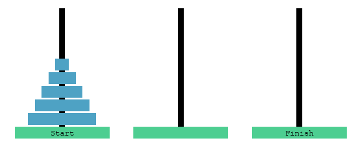
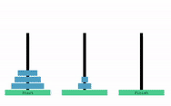

## Assignment
The file `visualise_hanoi.py` does not yet come into play. In the driver code of `hanoi.py`, keep all code having to do with visualisation commented. If you are not familiar with the towers of Hanoi first go to the section [What is towers of Hanoi?](#what-is-towers-of-hanoi)

Complete the `towers_of_hanoi` function in `hanoi.py`. It should be able to perform the moves necessary to solve the tower of Hanoi problem for n disks. The function has following parameters:
* `n`: amount of disks, also used to determine the active disk (see below).
* `source`: Tower from which to move active disk.
* `destination`: Tower to which the active disk moves.

When calling the function from outside, `n` refers to the amount of disks that will start at pole `A`. When called inside the function, `n` refers to which disk is being moved (active disk). The disk are numbered from smallest (1) to largest (n)

Example outside-function call:
```
towers_of_hanoi(5,'A','C','B')
```

<p align="center">
  
</p>

Example inside-function call
```
towers_of_hanoi(3,'A','C','B')
```
<p align="center">
  
</p>


The function should print the move it is about to perform. This print should contain what disk is being moved (active disk), and the source/destination tower. 

Example:
```
f"Move disk {n} from Tower {source} to Tower {destination}"
```

should return the following for the above gif:
```
f"Move disk 3 from Tower A to Tower C"
```

To solve the Towers of Hanoi with three disks, the following messages should be printed.
```
Move disk 1 from Tower A to Tower C
Move disk 2 from Tower A to Tower B
Move disk 1 from Tower C to Tower B
Move disk 3 from Tower A to Tower C
Move disk 1 from Tower B to Tower A
Move disk 2 from Tower B to Tower C
Move disk 1 from Tower A to Tower C
```


### Visualising the towers
If you completed the above assignment you can also easily add a visualisation. Simply uncomment the lines in the driver code refering to visualisation. Now after printing the movement of a disk add the function `game_loop()`. This function has already been completed. As arguments you should give it:
* n: which disk to move (active disk).
* source: The starting location of the active disk.
* destination: The end location of the active disk.

Example see above gif
```
game_loop(3,'A','C')
```

This visualisation works properly with a maximum number of 7 disks.

### What is towers of Hanoi?
The towers of Hanoi is a puzzle using three poles `A`, `B` and `C`. At the start of the game pole `A` has a certain number of disks (`n`). The goal is the move all these disks to pole `C`. There are three rules:
* You can only move one disk at a time.
* You must pick up the top-most disk of a pole.
* You may not place a larger disk on a smaller one.

You can play the game for yourself using [this link](https://www.mathsisfun.com/games/towerofhanoi.html). 

Besides being a fun little game it is also a great example of how recursion can drastically reduce the amount of code and computational complexity! In the assignment you will first create a solver for the towers of Hanoi using text. After that you can add a visualisation.

### iterative (non-recursive) solution
In case you are wondering what an iterative (non-recursive) solution to Towers of Hanoi is. I hope you agree that the recursive solution is a bit more elegant.
Code courtesy of [GeeksForGeeks](https://www.geeksforgeeks.org/iterative-tower-of-hanoi/)
```
# Python3 program for iterative Tower of Hanoi
import sys
 
# A structure to represent a stack
class Stack:
    # Constructor to set the data of
    # the newly created tree node
    def __init__(self, capacity):
        self.capacity = capacity
        self.top = -1
        self.array = [0]*capacity
 
# function to create a stack of given capacity.
def createStack(capacity):
    stack = Stack(capacity)
    return stack
  
# Stack is full when top is equal to the last index
def isFull(stack):
    return (stack.top == (stack.capacity - 1))
   
# Stack is empty when top is equal to -1
def isEmpty(stack):
    return (stack.top == -1)
   
# Function to add an item to stack.
# It increases top by 1
def push(stack, item):
    if(isFull(stack)):
        return
    stack.top+=1
    stack.array[stack.top] = item
   
# Function to remove an item from stack.
# It decreases top by 1
def Pop(stack):
    if(isEmpty(stack)):
        return -sys.maxsize
    Top = stack.top
    stack.top-=1
    return stack.array[Top]
   
# Function to implement legal
# movement between two poles
def moveDisksBetweenTwoPoles(src, dest, s, d):
    pole1TopDisk = Pop(src)
    pole2TopDisk = Pop(dest)
 
    # When pole 1 is empty
    if (pole1TopDisk == -sys.maxsize):
        push(src, pole2TopDisk)
        moveDisk(d, s, pole2TopDisk)
       
    # When pole2 pole is empty
    else if (pole2TopDisk == -sys.maxsize):
        push(dest, pole1TopDisk)
        moveDisk(s, d, pole1TopDisk)
       
    # When top disk of pole1 > top disk of pole2
    else if (pole1TopDisk > pole2TopDisk):
        push(src, pole1TopDisk)
        push(src, pole2TopDisk)
        moveDisk(d, s, pole2TopDisk)
       
    # When top disk of pole1 < top disk of pole2
    else:
        push(dest, pole2TopDisk)
        push(dest, pole1TopDisk)
        moveDisk(s, d, pole1TopDisk)
   
# Function to show the movement of disks
def moveDisk(fromPeg, toPeg, disk):
    print("Move the disk", disk, "from '", fromPeg, "' to '", toPeg, "'")
   
# Function to implement TOH puzzle
def tohIterative(num_of_disks, src, aux, dest):
    s, d, a = 'S', 'D', 'A'
   
    # If number of disks is even, then interchange
    # destination pole and auxiliary pole
    if (num_of_disks % 2 == 0):
        temp = d
        d = a
        a = temp
    total_num_of_moves = int(pow(2, num_of_disks) - 1)
   
    # Larger disks will be pushed first
    for i in range(num_of_disks, 0, -1):
        push(src, i)
   
    for i in range(1, total_num_of_moves + 1):
        if (i % 3 == 1):
            moveDisksBetweenTwoPoles(src, dest, s, d)
   
        else if (i % 3 == 2):
            moveDisksBetweenTwoPoles(src, aux, s, a)
   
        else if (i % 3 == 0):
            moveDisksBetweenTwoPoles(aux, dest, a, d)
 
# Input: number of disks
num_of_disks = 3
 
# Create three stacks of size 'num_of_disks'
# to hold the disks
src = createStack(num_of_disks)
dest = createStack(num_of_disks)
aux = createStack(num_of_disks)
 
tohIterative(num_of_disks, src, aux, dest)
 
# This code is contributed by divyeshrabadiya07.
```
